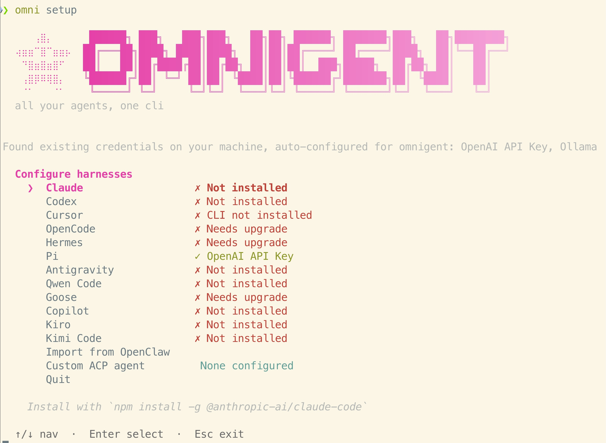
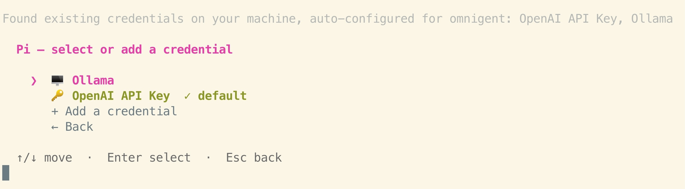
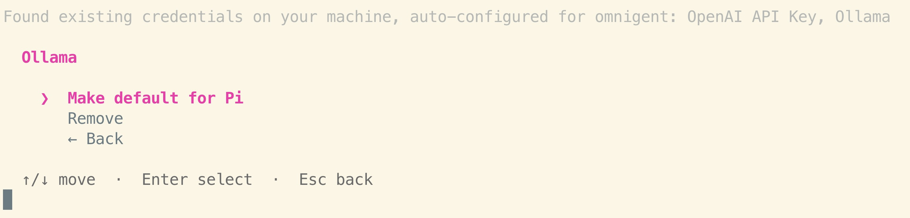
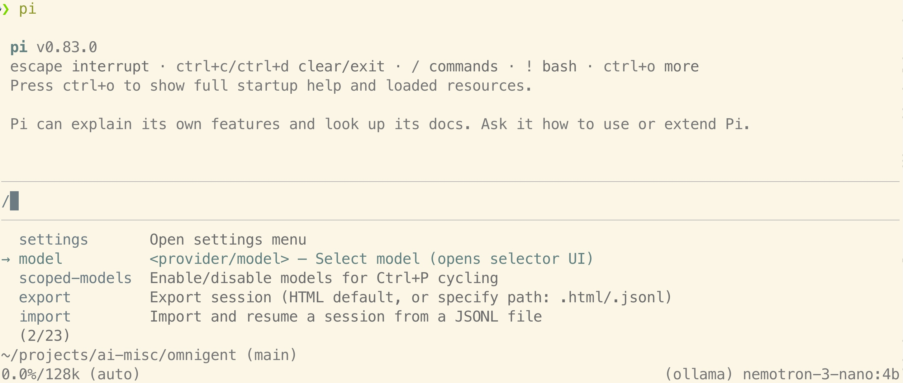
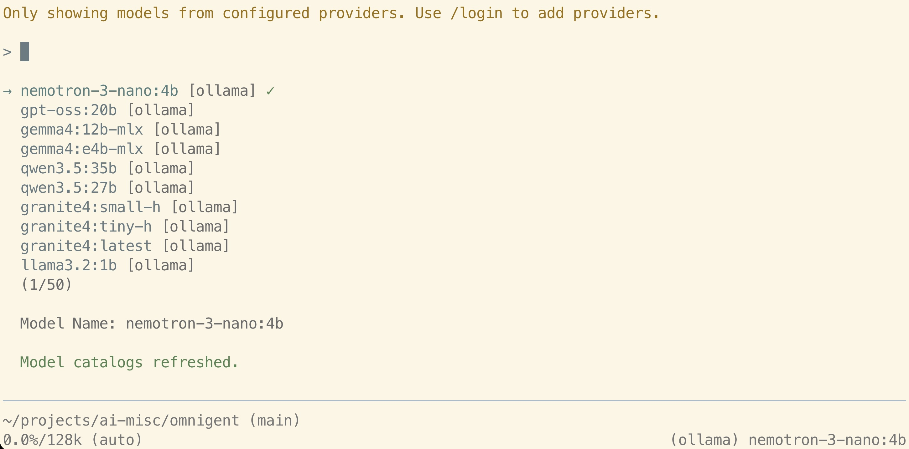
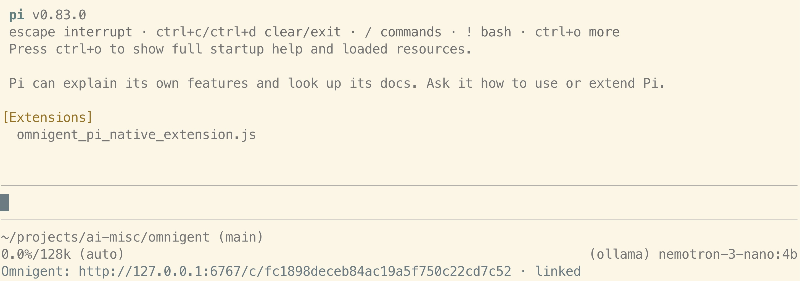
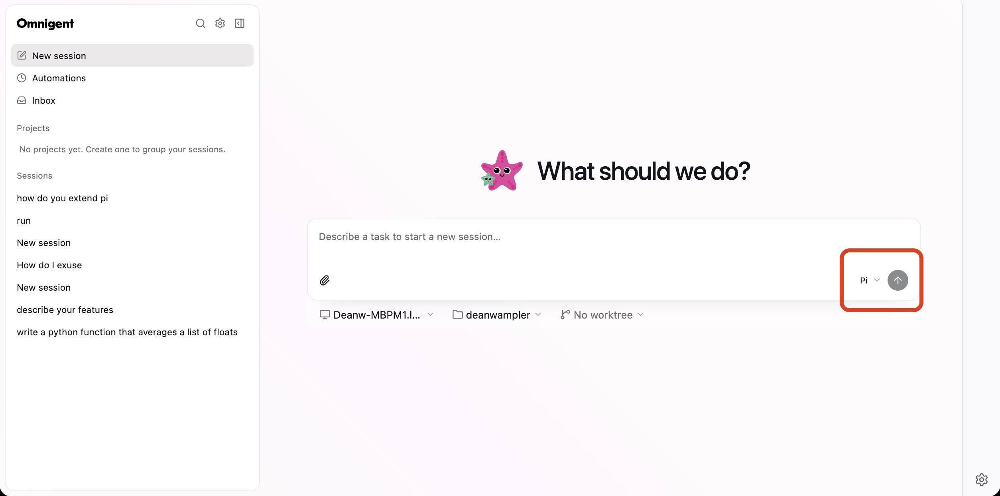
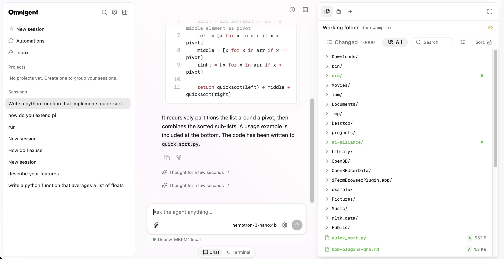

# README for Omnigent Experimentation

[Omigent](https://omnigent.ai/) ([GitHub repo](https://github.com/omnigent-ai/omnigent)) is a "meta" agent framework that abstracts over particular agent frameworks (like [pi](https://pi.dev/)) and model inference providers. It is backed by Databricks, among other contributors.

[This page](https://omnigent.ai/quickstart/install#install-omnigent) has instructions for installing the desktop app, but one thing I noticed is that it doesn't always install the very latest release. At the time of this writing (August 4th, 2026), it installed V0.6.0, while the latest as of yesterday was V0.8.1!

The CLI can be installed using Brew, but it is also currently fixed at V0.6.0,

```shell
brew install omnigent-ai/tap/omnigent
```

> [!NOTE]
> It appears you can use the V0.6.0 desktop app with the newer version of back-end server. The installation instructions I discuss next don't include the app, but they do provide an equivalent web UI that you can open in a browser.

So, I downloaded the V0.8.1 distribution from the [GitHub repo releases page](https://github.com/omnigent-ai/omnigent/releases) and used the `omnigent-0.8.1/scripts/install_oss.sh` to install the CLI.

You could effectively run the same command on the GitHub repo's `HEAD` using this `curl` command:

```shell
curl -fsSL https://raw.githubusercontent.com/omnigent-ai/omnigent/main/scripts/install_oss.sh | sh
```

The CLI `omnigent` and its equivalent, `omni`, are in `$HOME/.local/share/uv/tools/omnigent/bin/` (the install script uses `uv`). They are symlinked to `$HOME/.local/bin/`, which is added to your `PATH`.

To see the available CLI commands:

```shell
omni --help
```


## Configuring Omnigent

You need specify options like the inference service. Everything gets saved in `$HOME/.omnigent`.

```shell
omni setup
```

You are presented with this screen:



I want to use the [Pi](https://pi.dev/) agent framework with [Ollama](https://ollama.com) for local inference, so I arrowed down to Pi and hit return to configure it.



I hit return to select Ollama.



I hit return again to make Ollama the default service I'll use for Pi.

Finally, I hit escape twice to go back to the agent selection screen and then exit from the setup.

These customizations are saved in `$HOME/.omnigent/config.yaml`.

## Installing and Configuring Pi

I also needed to install [Pi](https://pi.dev/), then configure it to use Ollama. Pi configuration files are found in `$HOME/.pi/agent`.

After installing Pi as described on its home page, I followed [these instructions](https://pi.dev/docs/latest/models) to create
`$HOME/.pi/agent/models.json` with the list of local models I might use:

```json
{
  "providers": {
    "ollama": {
      "baseUrl": "http://localhost:11434/v1",
      "api": "openai-completions",
      "apiKey": "ollama",
      "models": [
        { "id": "nemotron-3-nano:4b" },
        { "id": "gpt-oss:20b" },
        { "id": "gemma4:12b-mlx" },
        { "id": "gemma4:e4b-mlx" },
      ]
    }
  }
}
```

I then ran the `pi` command, typed `/` to start a command, and arrowed to `model`.



I hit return and got the list of local models I have installed for Ollama:



(I have more models installed than I listed in `models.json`.) I selected `nemotron-3-nano:4b`, then hit return.

Finally, I hit ctrl+d to exit the `pi` CLI.

## Running Omnigent with Pi

Now that everything is configured, I can run a session with Pi:

```shell
omni pi
```



It mentions an extension, but doesn't tell you how to install it. I typed in "how do you extend pi", but Nemotron interpreted this as a question about computing the digits of π!

Also, the prompt editing is very weird. It doesn't support the usually delete and arrow keys to navigate and edit what you are typing. This is one reason `omnigent` is so useful.

When you launch from the command line, you can also open a web UI,

```shell
open http://127.0.0.1:6767/
```

(If this URL isn't found, relaunch `omni pi` with the `--server http://127.0.0.1:6767` argument.)



You might need to select Pi in the drop-down menu on the lower-right, as indicated with the red box.

Under the prompt is the current server (my laptop), the working directory (my home directory is shown), and the work branch. You can edit all of them.

On the left is a history of previous prompts.

Here is an example of what you see after a prompt, "Write a python function that implements quick sort", in this case:



> [!TIP]
> While setting things up the first time, I had a problem that nothing seemed to happen when I entered prompts. No replies and no error messages. Only when I happened to click the _> Terminal_ button at the bottom did I see error messages about not being properly configured.

## Impressions

Omnigent is a nice tool if you want a lot of flexibility for using different agent frameworks and inference services, while having a consistent L&F experience. Otherwise, so far I haven't seen any other features that would make Omnigent a better choice than other web front ends, but I've only spent a few hours using it.


